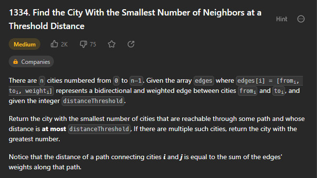
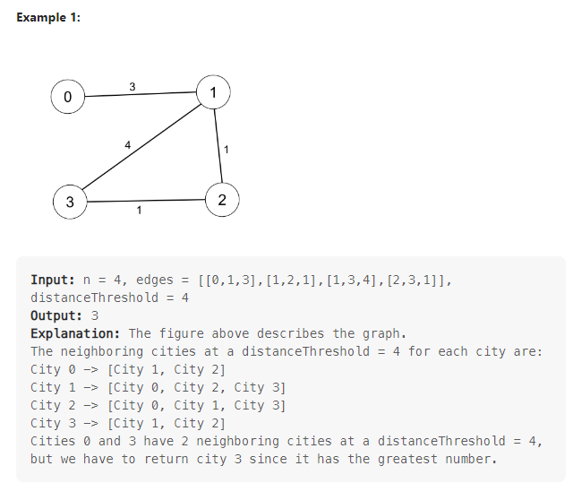
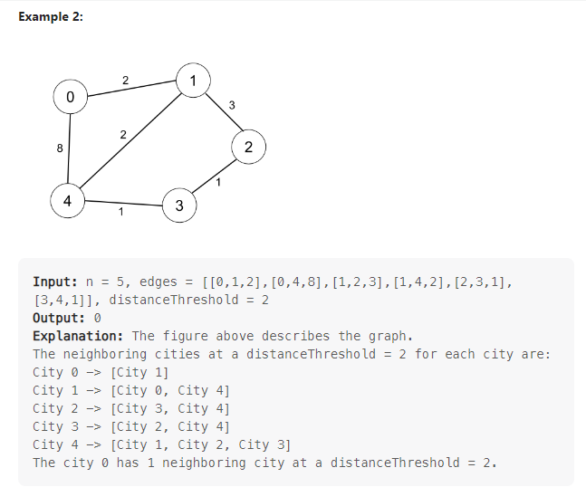
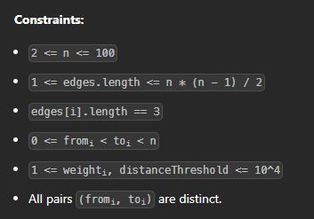

# Página de acesso ao exercício
[Smallest Number of Neighbors](https://leetcode.com/problems/find-the-city-with-the-smallest-number-of-neighbors-at-a-threshold-distance/description/) 
# Explicação

# Exemplos

# Restrições

